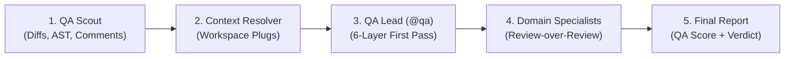

# SPEC-HARNESS-KIT Global Workforce 🤖🚀

A unified, centralized harness for specialized AI agents, domain reviewers, rules, and skills. This repository maintains a single "source of truth" for your AI engineering workforce, allowing you to use them globally across multiple AI CLIs without polluting individual project codebases.

---

## 🌟 Key Capabilities & Highlights

- **Zero Pollution:** Your repositories stay clean. No duplicated `.agent/` or divergent config files scattered across projects.
- **Multi-CLI Compatibility:** Seamlessly integrates with Antigravity (`~/.gemini/antigravity/`), Claude (`~/.claude/`), Codex, OpenCode, and Pi.
- **🔌 Workspace Plugs Engine (`plugs/`):** Dynamically mounts workspace-scoped rules, specialist reviewers, skills, and MCPs (e.g., `aton`, `saffira`, `saffira-admin`, or `personal`) based on folder context or prompt keywords.
- **🛡️ Multi-Tier QA Pipeline (Review-over-Review):** Autonomous 5-phase quality assurance pipeline (Tier-1 Scout -> Tier-2 Lead Orchestrator -> Tier-3 Domain Specialists -> Quality Gate Seal).
- **⚡ Cost-Optimized Model Economics:** Defaults to **Gemini 3.8 Flash (High)** across all agents for extreme token efficiency and speed, with deep reasoning (`--deep` / Gemini Pro) and Claude on-demand (`--model=claude`).

---

## 🛠 Supported CLIs

SPEC-HARNESS-KIT is CLI-agnostic and designed to work with:
- **Antigravity CLI** (`~/.antigravity/` / `~/.gemini/antigravity/`)
- **Claude CLI** (`~/.claude/`)
- **Codex CLI** (`~/.codex/`)
- **OpenCode CLI** (`~/.config/opencode/`)
- **Pi Coding Agent** (`~/.pi/agent/`)

---

## 🚀 Installation & Synchronization

### Option A: Global Installation (System-Wide)

Installs agents, rules, and skills globally to be discovered across all CLIs:

```bash
git clone https://github.com/zatzk/spec-harness-kit.git ~/Code/spec-harness-kit
~/Code/spec-harness-kit/scripts/install.sh
```

### Option B: Workspace / Project Installation

Configures agents, rules, and workflows directly inside a target workspace or project (e.g., `~/Work/Aton` or `~/MyProjects`):

```bash
# Copy Mode (Self-contained, portable)
~/Code/spec-harness-kit/scripts/install-project.sh ~/Work/Aton

# Symlink Mode (Active Development)
~/Code/spec-harness-kit/scripts/install-project.sh -s ~/MyProjects
```

---

## 👥 Agent Catalog

### 1. Core Engineering & Product Workforce

Call these agents using the `@` prefix in your favorite CLI. All core agents run on **Gemini 3.8 Flash** by default.

| Agent | Description | Primary Deliverables |
| :--- | :--- | :--- |
| **@spec-master** | **Master Orchestrator:** High-level coordinator, decomposes complex requests into phases and manages multi-tier workflows. | Implementation Plans, Task Specifications. |
| **@squad-creator** | **Squad Architect:** Analyzes tasks to assemble specialized agent squads, including domain and plug reviewers. | Squad Manifests, Team Protocols. |
| **@dev** | **Senior Developer:** Workspace-aware implementation specialist (clean code, TDD, proactive QA harness compliance). | Source files, unit/integration test suites. |
| **@qa** | **QA Lead Orchestrator:** Exclusive authority for quality verdicts (PASS/FAIL), coordinates Review-over-Review pipeline. | Unified Code Review Reports, QA Score. |
| **@qa-scout** | **QA Scout / Scraper:** Low-token worker for harvesting diffs, PR comments, and domain AST parsing. | Inspection Manifest (YAML). |
| **@architect** | **System Architect:** Designs tech stacks, modular boundaries, CAP theorem trade-offs, and distributed patterns. | Architecture Design Docs, Mermaid Topology, ROI Tables. |
| **@data-engineer** | **Data Engineer:** Designs database schemas, migrations, query plans, and dba-harness compliance. | Reversible migrations, models, query optimizations. |
| **@devops** | **DevOps Engineer:** Exclusive authority for git pushes, CI/CD pipelines, and deployment automation. | CI/CD pipelines, container configs, deploy scripts. |
| **@ux** | **UX/UI Designer:** Enforces atomic design systems, visual consistency, and micro-animations. | Design System Specs (`DESIGN.md`). |
| **@writer** | **Technical Writer:** Specialized in documentation, blog posts, changelogs, and content lifecycle. | Technical documentation, blog drafts, changelogs. |
| **@pm** | **Product Manager:** Drives product strategy, feature roadmap, and user value definition. | Product Requirement Docs (PRDs). |
| **@po** | **Product Owner:** Splits requirements into stories, backlog, and acceptance criteria. | Refined user stories, acceptance criteria. |
| **@analyst** | **Business Analyst:** Requirements gathering, feasibility studies, and functional specs. | Functional specs (`spec.md`). |
| **@sm** | **Scrum Master:** Facilitator for agile workflows, sprints, and removing blockers. | Sprint status reports, blocker logs. |
| **@researcher** | **Researcher:** Documentation harvesting, API fact-finding, and deep-dive exploration. | Structured Research Notes. |
| **@wayfinder** | **Strategic Planner:** Strategic project mapping, fog-of-war deconstruction, and ticket planning. | Local Markdown Map files (`map.md`), decision tickets. |

### 2. Specialized Reviewers (Workspace Plugs)

Domain-specific subagents that perform cross-validation and review-over-review:

| Specialist Agent | Domain & Focus | Key Standards / Harnesses |
| :--- | :--- | :--- |
| **@security-reviewer** | AppSec & Vulnerabilities | OWASP Top 10, Secrets Exposure, `security-harness.md` |
| **@dba-reviewer** | Database Performance & Schemas | Reversible Migrations, N+1 Prevention, `dba-harness.md` |
| **@architecture-reviewer** | High-Level Design (HLD) | CAP Theorem, Saga, Outbox, CQRS, Mermaid Topology |
| **@lld-reviewer** | Low-Level Design (LLD) | SOLID Principles, 9 Object Calisthenics Rules, GoF Patterns |
| **@qa-reviewer** | Test Architecture & Assertiveness | Value-Oriented Testing, Tautological Mock Audit, QA Score |
| **@saffira-backend-reviewer** | Saffira Core Backend | Strict TS (no `any`), no JSDocs, decoupled IoC |
| **@saffira-admin-backend-reviewer** | Saffira Admin Backend | NestJS 11, Token IoC, `nestjs-zod` DTOs, Testcontainers |
| **@saffira-admin-frontend-reviewer** | Saffira Admin Frontend | Angular Signals, PrimeNG wrappers, `dom-testing.utils` |

---

## 🔌 Workspace Plugs Architecture (`plugs/`)

Workspace Plugs allow `spec-harness-kit` to adapt to corporate ecosystems and personal projects without code duplication:

```
spec-harness-kit/
├── plugs/
│   ├── aton/                    # Corporate Ecosystem (Git Submodule)
│   │   ├── manifest.yaml        # Triggers, defaults, specialist mappings
│   │   ├── global/              # Corporate rules, skills, MCPs (ClickUp)
│   │   └── saffira/             # Subproject-specific harnesses & reviewers
│   │       ├── backend/
│   │       └── saffira-admin/
│   └── personal/                # User personal workspace template
│       ├── manifest.yaml
│       ├── rules/
│       ├── skills/
│       └── mcps/
```

### Context Auto-Resolution
When executing `@dev` or `@qa`:
1. The agent detects keywords (e.g. `"saffira-admin"`, `"aton"`, `"personal"`) or the git remote URL.
2. It automatically reads the matching `manifest.yaml` and activates the corresponding rules, skills, and MCPs.
3. `@dev` writes code following the exact standards that `@qa` will audit against (*First-Time-Right*).

---

## 🛡️ Multi-Tier QA Pipeline (`skills/qa-pipeline/`)

The evolved quality assurance workflow operates in 5 deterministic phases:



To run the pipeline:
```bash
# In chat:
@qa revise o PR #42 no saffira-admin

# With deep reasoning mode:
@qa revise o PR #42 no saffira-admin --deep

# With Claude override:
@qa revise o PR #42 no saffira-admin usando claude
```

---

## 📂 Repository Structure

- `agents/`: Agent definitions with standard YAML frontmatter, tools, and model declarations.
- `rules/`: Global rules, constitutions, tech-presets, and templates.
- `plugs/`: Workspace Plugs (Aton corporate submodule + Personal projects).
- `skills/`: Global capabilities, QA pipelines, refactoring, and development workflows.
- `scripts/`: Automation scripts for global (`install.sh`) and project-local (`install-project.sh`) setups.
