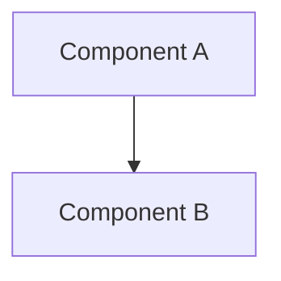

# Technical Implementation Plan: [Feature Name]

## 1. Architectural Blueprint
*Describe the high-level architecture changes. Which components will be created, modified, or deleted?*



## 2. Proposed Changes
*Group files by component/layer and list modifications.*

### [Component Name]
#### [NEW] [file_name](file:///path/to/file)
#### [MODIFY] [file_name](file:///path/to/file)

## 3. Data Schema & Models
*Define any changes to databases, schemas, interfaces, types, or API endpoints.*

```typescript
interface NewModel {
  id: string;
}
```

## 4. Risks & Mitigations
- **Performance Impact:** *Will this affect build/runtime performance?*
- **Backward Compatibility:** *Does this introduce breaking changes?*

## 5. Verification & Testing Plan
### Automated Tests
- *What unit, integration, or E2E tests will be written or run?*
- *List commands to run the test suite.*

### Manual Verification
- *How will we manually test and verify the feature works?*
